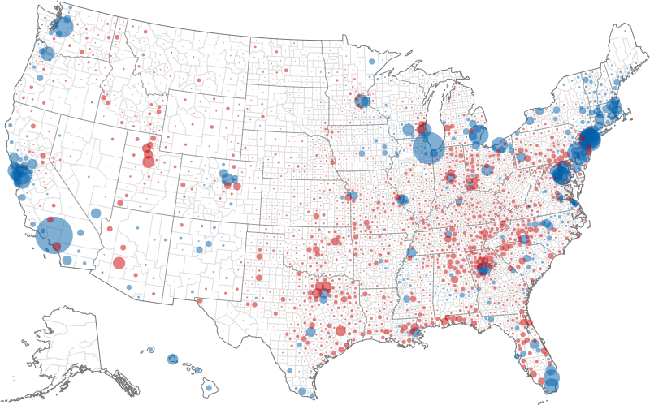

# mapshaper-cookbook

[blocks](https://bost.ocks.org/mike/example/), but for [mapshaper](https://mapshaper.org/)

### Clip points in a CSV with a shapefile

This take a list [fires detected in Australia](https://blocks.roadtolarissa.com/1wheel/46874895034f5bded13c97097bf25a83), clips them to New South Wales and counts how many occur each day. 

```bash
mapshaper aus-fire/fire_nrt.csv \
  -clip aus-fire/NSW_STATE_POLYGON_shp.shp \
  -filter-fields acq_date \
  -dissolve acq_date calc='n = count()' \
  -o aus-fire/by-day-nsw.csv
```

The input data looks like this:

```csv
latitude,longitude,brightness,scan,track,acq_date,acq_time,satellite,instrument,confidence,version,bright_t31,frp,daynight
-18.439,145.293,331.3,1.3,1.1,2020-01-01,0050,Terra,MODIS,48,6.0NRT,307.5,22.5,D
-18.148,142.975,338.2,1,1,2020-01-01,0050,Terra,MODIS,65,6.0NRT,308.3,21.1,D
-18.16,142.993,337.3,1,1,2020-01-01,0050,Terra,MODIS,76,6.0NRT,302.5,23.4,D
```

and gets shrunk down to this:

```csv
acq_date,n
2020-01-01,3686
2020-01-02,4389
2020-01-03,4257
```

### Make a map of votes



From Mattew Bloch's [2017 NACIS](https://www.youtube.com/watch?v=X-CGAS4YaPA) workshop.

```bash
mapshaper election/countyp010.shp name=counties \
  -filter 'STATE_FIPS < 72' \
  -filter 'COUNTY != ""' \
  -dissolve FIPS copy-fields=STATE \
  -simplify 2% \
  -proj albersusa \
  -points inner + name=points \
  -i election/2012-president-general-counties.csv string-fields=fips name=data \
  -filter-fields fips,obama,romney \
  -each 'margin = obama - romney' \
  -each 'absmargin = Math.abs(margin)' \
  -join target=points data keys=FIPS,fips \
  -sort absmargin descending \
  -svg-style r='Math.sqrt(absmargin) * 0.02' \
  -svg-style opacity=0.5 fill='margin > 0 ? "#0061aa" : "#cc0000"' \
  -lines STATE target=counties \
  -svg-style stroke="#ddd" where='TYPE == "inner"' \
  -svg-style stroke="#777" where='TYPE == "outer"' \
  -svg-style stroke="#999" where='TYPE == "STATE"' \
  -o election/map.svg target=counties,points
```

### More reading

- [Automated Mapmaking](https://docs.google.com/presentation/d/1ghiHjKNqx_76HtwtpmsDZ_QE738oRmB_t6yielloRFU/edit#slide=id.g630b784938_0_135)
- [Command Line Carto](https://docs.google.com/presentation/d/1VJ8mf3n6qP4urJI7LsfdZcoDHcz4DNy6h3PQbfJ4lXM/edit#slide=id.p)
- [Command-Line Cartography, Part 1](https://medium.com/@mbostock/command-line-cartography-part-1-897aa8f8ca2c)
- [Introduction to Mapshaper CLI](https://github.com/mbloch/mapshaper/wiki/Introduction-to-the-Command-Line-Tool)
- [Mapshaper CLI Reference](https://github.com/mbloch/mapshaper/wiki/Command-Reference)
